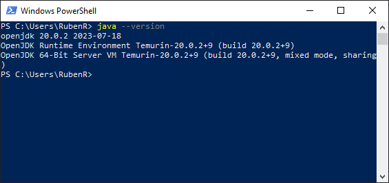

# Guía para Operar con iButtons

## Índice

1. [Introducción](#introducción)
2. [Requisitos](#requisitos)
3. [Instalación de Software](#instalación-de-software)
4. [Configuración](#configuración)
5. [Conexión a Dispositivos](#conexión-a-dispositivos)
6. [Descarga de Datos](#descarga-de-datos)
7. [Conclusión](#conclusión)

## Introducción

Los iButtons son dispositivos electrónicos pequeños y robustos que almacenan información en un formato digital. A menudo tienen la forma de un botón metálico del tamaño de una moneda y están diseñados para ser leídos mediante un dispositivo de interfaz especial. Estos dispositivos pueden conectarse a una variedad de hardware, como lectores de mano, adaptadores para computadoras y otros sistemas electrónicos.
Los iButtons utilizan el protocolo de comunicación 1-Wire, desarrollado por Maxim Integrated  (anteriormente Dallas Semiconductor), permite la transferencia de datos entre una computadora y múltiples dispositivos electrónicos utilizando un único cable de datos, además de un cable de tierra. Cada dispositivo en la red 1-Wire tiene una dirección única, lo que permite el direccionamiento individual. El protocolo es conocido por su simplicidad y eficiencia, y es comúnmente utilizado en aplicaciones como control de acceso, monitoreo ambiental y registro de datos. Su diseño robusto lo hace apto para operar en condiciones adversas.

## Materiales

- iButton:
    - [Thermochron de Alta Resolución DS1921G-F5# (4Kb Logger -40/85°C)](https://mcielectronics.cl/shop/product/thermochron-de-altaresolucion-ds1921g-f5-4kb-logger-40-85c-ibutton-9700/): El Thermochron DS1921G es un registrador de temperatura iButton de la marca Maxim que almacena mediciones de temperatura en su memoria interna. Puede almacenar hasta 2048 registros en intervalos programables de 1 a 255 minutos y también registra un histograma de temperatura. Si la temperatura se sale del rango establecido, se guarda esta información. Se puede leer los datos mediante el protocolo 1-Wire utilizando dispositivos de lectura como el adaptador USB DS9490R o DS9490B. Cada iButton tiene un número único de identificación de 64 bits.
    - [Hygrochron Temperatura y Humedad iButton DS1923 (8Kb Logger -20°C a 85°C)](https://mcielectronics.cl/shop/product/hygrochron-temperatura-y-humedad-ibutton-ds1923-8kb-logger-ibutton-9749/) El Thermochron DS1923 es un registrador de temperatura y humedad que almacena mediciones en su memoria interna. Puede programarse para iniciar misiones de registro de datos de inmediato, después de un tiempo definido por el usuario o cuando se active una alarma de temperatura. Puede almacenar hasta 8192 lecturas de temperatura y humedad con diferentes resoluciones y a intervalos personalizables. También registra un histograma de temperatura y eventos fuera del rango de temperatura establecido. Puede transferir datos a través del protocolo 1-Wire utilizando dispositivos como el adaptador USB DS9490R o DS9490B. Cada iButton tiene una identificación única de 64 bits para trazabilidad. Su carcasa de acero inoxidable es resistente a condiciones ambientales adversas. 
- Lector de iButton: 
    - [DS9490R# – Adaptador USB a 1-Wire](https://mcielectronics.cl/shop/product/ds9490r-adaptador-usb-a-1-wire-ibutton-9670/): El adaptador DS9490R permite conectar una red 1-Wire (iButton) a tu computador. Este adaptador es necesario para poder trabajar con redes 1-Wire. Cuenta con un conector RJ11 de teléfono estándar para conectar a la red, y un conector USB para conectar al computador. Utilizalo junto a un cable adaptador como el DS1402-RP3, DS1402-DR8 ó DS9092GT. Debe incuir el [Cable Retenedor DS1402-RP3](https://mcielectronics.cl/shop/product/cable-retenedor-ds1402-rp3-para-adaptador-de-ibutton-usb-rs232-ibutton-9669/)
    - [DS9490B# – Lector iButton® USB (1-Wire)](https://mcielectronics.cl/shop/product/ds9490b-lector-ibutton-usb-1-wire-ibutton-9619/): El DS9490B es un adaptador USB en el cual se puede insertar un iButton tamaño F5. El iButton queda sujeto en su interior. El DS9490B esta basado en el chip DS2490 USB a 1-Wire bridge chip.
- Software para iButton: [OneWireViewer](./software/install_1_wire_drivers_x64_v405.zip) es un práctico programa de software que permite a los usuarios leer y escribir fácilmente en iButtons con una PC con Windows que tenga un puerto USB.
- Computadora: Notebook o PC de escritorio que utiliza los sistemas operativos Windows 10, Windows 7, Windows Vista o Windows XP.

## Instalación de Software

1. Instalación de Java: Muchas PC tienen software Java instalado de fábrica. OneWireViewer requiere Java 6 o superior. Para verificar si tiene Java instalado o qué versión tiene, abra el símbolo del sistema y escriba “java –-version”, como se muestra en la Figura 1.

    

    **Figura 1.** Verificación de la versión de Java instalado.

Si se requiere instalar Java, puede hacerlo desde https://www.java.com/es/download/ie_manual.jsp.

Descargue el software desde el sitio oficial.

2. Descargue los controladores OneWireViewer y 1-Wire incluidos

NOTA: NO INSERTE AÚN EL ADAPTADOR USB DS9490R# EN LA PC. ESTO NO DEBE HACERSE HASTA EL PASO 4 Y, POR LO GENERAL, CAUSARÁ PROBLEMAS DE INSTALACIÓN SI SE REALIZA ANTES DEL PASO 4.

Descargue los controladores OneWireViewer y 1-Wire incluidos aquí. Estas páginas tienen menús desplegables para ayudar a seleccionar el archivo correcto para el sistema operativo que está ejecutando. Los sistemas operativos de Microsoft vienen en versiones de 32 y 64 bits. Si no está seguro de qué versión tiene, vaya al menú de inicio y escriba "panel de control". Seleccione Sistema y Seguridad y luego seleccione Sistema para mostrar la versión de su sistema operativo, como se muestra en la Figura 3.
3. Siga las instrucciones en pantalla.

## Configuración

1. Abra el software.
2. Vaya a `Configuración`.
3. Ajuste los parámetros según sus necesidades.

## Conexión a Dispositivos

1. Conecte el lector de iButton a la computadora.
2. Inserte el iButton en el lector.
3. Abra el software y seleccione `Conectar`.

## Descarga de Datos

1. En el software, vaya a `Descargar Datos`.
2. Seleccione el iButton conectado.
3. Presione `Iniciar Descarga`.

## Conclusión

Con estos pasos, debería ser capaz de operar básicamente con iButtons.

---
