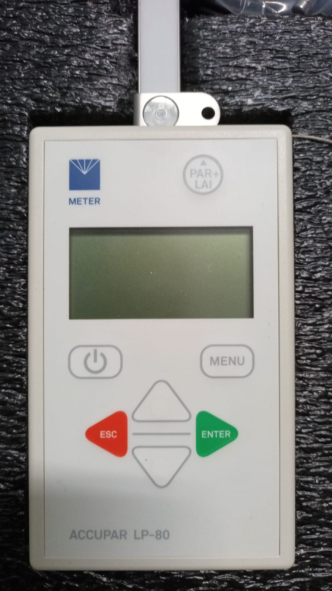
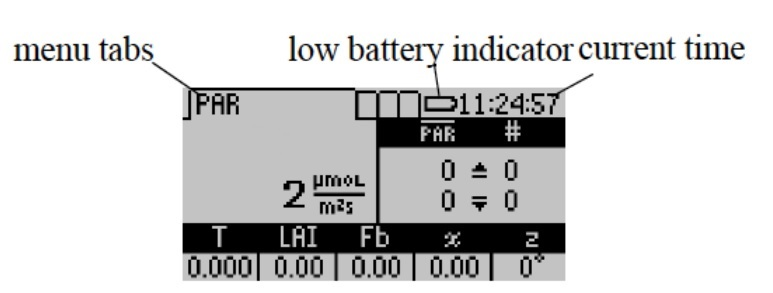
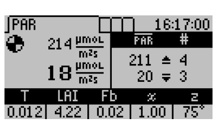
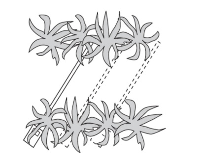
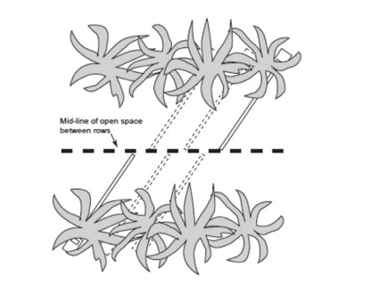

# Manual de Uso Detallado del Sensor AccuPAR LP-80

## Tabla de Contenidos

1. [Introducción](#introducción)
2. [Preparativos](#preparativos) (Página 8, 10)
3. [Menú y Teclado](#menu-y-teclado) (Páginas 8, 10)
4. [Mediciones Manuales](#mediciones-manuales) (Página 8, 34-35)
5. [Tomar Mediciones](#tomar-mediciones) (Página 10)
6. [Configuración Adicional](#configuración-adicional) (Páginas 35-37)
7. [Resolución de Problemas](#resolución-de-problemas) (Página 71)

## Introducción

El AccuPAR LP-80 es un ceptómetro de operación a batería diseñado para medir la radiación fotosintéticamente activa (PAR) y calcular el índice de área foliar (LAI) en dosel de plantas. Este dispositivo integra un registrador de datos y una sonda controlados por un microprocesador. La sonda está equipada con 80 sensores independientes, separados por 1 cm entre sí. Estos fotosensores son capaces de medir la Radiación Fotosintéticamente Activa (PAR) en el rango de longitud de onda de 400 a 700 nm. El AccuPAR muestra los niveles de PAR en unidades de micromoles por metro cuadrado por segundo (μmol * m^−2 * s^−1). Además, el instrumento ofrece la flexibilidad de realizar mediciones tanto de forma manual como automática sin necesidad de supervisión.

**Cuadro 1.** Especificaciones Técnicas del AccuPAR Modelo LP-80.

| Característica                    | Especificación                                      |
| --------------------------------- | ---------------------------------------------------- |
| Entorno Operativo                 | 0◦ a 50◦ C, 0 a 100% humedad relativa |
| Longitud de la Sonda              | 86.5 cm                                              |
| Número de Sensores                | 80                                                   |
| Rango PAR                         | 0 a 2,500 µmol m−2 s−1                               |
| Resolución                        | 1 µmol m−2 s−1                                       |
| Resolución Espacial Mínima        | 1 cm                                                 |
| Capacidad de Almacenamiento       | 1 MB Flash                                           |
| Intervalo de Registro Automático  | Seleccionable por el usuario, entre 1 y 60 min       |
| Peso del Instrumento (con pilas)  | 0.55 kg (1.21 lbs)                                   |
| Recuperación de Datos             | Directa vía RS-232                                   |
| Teclado                           | 7 teclas, controlado por menú                         |
| Reloj                             | 24 horas ±1 minuto por mes                            |
| Cable de Interfaz                 | Cable RS-232                                          |
| Energía                           | Cuatro pilas AAA alcalinas                            |
| Conector de Sensor PAR Externo    | Conector circular sellado de 5 pines con bloqueo      |

Este manual detallado tiene como objetivo guiar al usuario en el uso efectivo del dispositivo en el campo.

## Preparativos (Página 8, 10)

### Componentes Necesarios

Asegúrate de tener todos los componentes que vienen con el kit:

- AccuPAR modelo LP-80
- Cable RS-232
- Manual del Operador
- Sensor PAR Externo
- Destornillador Phillips #1

> **Nota**: Verifica que todos los componentes estén presentes antes de salir al campo.

### Encendido del Instrumento

1. Localiza la tecla `ON/OFF` en la esquina superior izquierda del dispositivo.
2. Presiona la tecla para encender el AccuPAR LP-80.

> **Nota**: El dispositivo se apagará automáticamente después de 10 minutos de inactividad para ahorrar batería.

## Menú y Teclado (Páginas 8, 10)

### Teclado del AccuPAR

El teclado del AccuPAR modelo LP-80 cuenta con un panel de 7 teclas diseñado para ofrecer una navegación intuitiva y un uso sencillo del sistema operativo. A continuación, se describen las funciones específicas de cada tecla:

* **Tecla ON/OFF:**  Situada en la esquina superior izquierda, esta tecla sirve para encender o apagar el instrumento. El AccuPAR se apagará automáticamente tras 10 minutos de inactividad.

* **Tecla MENÚ:** Permite alternar entre los cuatro menús disponibles en el sistema.

* **Teclas de Flecha ARRIBA y ABAJO:** En el menú de Muestreo PAR, estas teclas inician las lecturas PAR por encima (flecha hacia arriba) y por debajo (flecha hacia abajo) del dosel. En otros menús, se utilizan para navegar entre diferentes elementos y ajustar valores numéricos en submenús.

* **Tecla Verde Redonda:**  Ubicada en la esquina superior derecha del teclado, junto al logotipo de AccuPAR, esta tecla tiene la misma función que la tecla de flecha hacia abajo. Está diseñada como una alternativa ergonómica para tomar múltiples muestras PAR debajo del dosel.

* **Tecla ESC:** Cancela la lectura PAR actual que se muestra en la parte inferior del menú de Muestreo PAR, anula las opciones en otros menús y permite navegar hacia la izquierda en la pantalla de anotaciones.

* **Tecla ENTER:** Guarda las lecturas PAR actuales en el menú de Muestreo PAR, selecciona elementos en otros menús y permite navegar hacia la derecha en la pantalla de anotaciones.

    

    **Figura 1.** Teclado del AccuPAR modelo LP-80.

### Navegación en el Menú

El AccuPAR LP-80 tiene una interfaz de usuario basada en menús. Aquí hay una guía rápida para navegar:

1. **Menús Principales**: Hay cuatro menús principales: `PAR/LAI`, `Log`, `Data`, `Config`.
2. **Navegación**: Usa el botón `MENU` para alternar entre estos cuatro menús.
3. **Selección de Opciones**: Dentro de cada menú, utiliza las teclas de flecha arriba (`↑`) y abajo (`↓`) para moverte entre las diferentes opciones.
4. **Confirmación y Salida**: Usa las teclas `ENTER` para confirmar una selección y `ESC` para salir o retroceder.

 **Nota**: Las teclas de flecha también se utilizan para iniciar mediciones en el menú PAR/LAI.

**Figura 2.** Menú de la pantalla AccuPAR modelo LP-80.

## Mediciones Manuales (20442_LP-80_Manual_Web.pdf, Páginas 11-12)

El LP-80 está equipado con un sensor PAR externo que se acopla al orificio situado en el nivel de burbuja y se conecta al puerto ubicado en el lado derecho del dispositivo. Esta configuración permite llevar a cabo mediciones PAR simultáneas tanto por encima como por debajo del dosel, sin necesidad de mover el LP-80. Para garantizar la coherencia en las respuestas PAR entre el sensor externo y la sonda del dispositivo, el LP-80 utiliza este sensor para realizar calibraciones, tal como se detalla en la Sección 4.1.

El sensor cuántico externo que se incluye con el LP-80 es el modelo Apogee SQ100X. Este sensor es altamente preciso; sin embargo, el factor que más comúnmente introduce errores es el cambio, incluso mínimo, en la posición del sensor. Para obtener mediciones precisas, es crucial que el sensor se mantenga en una posición perfectamente horizontal.

### Pasos para realizar mediciones manuales

1. Acceso a la Pestaña PAR
    - Navegue hasta la pestaña llamada `PAR`.

2. Medición PAR por Encima del Dosel
    - Presione el botón `ARRIBA`.
    - El valor medido se mostrará en la esquina superior derecha de la pantalla.

3. Medición PAR Debajo del Dosel
    - Si desea realizar mediciones debajo del dosel, conecte un sensor externo.
    - Si se conecta un sensor externo, el LP-80 registrará lecturas tanto por encima como por debajo del dosel.

4. Opciones de Medición Debajo del Dosel
    - Presione `ABAJO` o `PAR-LAI` en la esquina superior derecha del teclado.
    - El LP-80 recalcula los datos resumidos después de cada lectura PAR debajo del dosel.
    - Otros datos relevantes se mostrarán en la parte inferior de la pantalla (Ver Figura 3).

#Figura 8: Pantalla de Medición de PAR Activo
    - El LP-80 actualiza y muestra cálculos de τ, LAI, Fb, χ y z en la parte inferior de la pantalla con cada medición PAR subsiguiente debajo del dosel.

5. Registro de Mediciones
    - Con cada medición, se muestra un número al lado del valor PAR que indica el número de mediciones completadas.
    - El valor PAR mostrado es el promedio de las mediciones realizadas.

6. Notas Adicionales
    - Cuando se conecta un sensor externo, el LP-80 utiliza estas lecturas para calcular el LAI.
    - Los datos resumidos se recalculan usando la última lectura por encima del dosel.

7. Guardar o Descartar Mediciones
    - Presione `ENTRAR` para acceder a la pantalla de Guardar.
    - Presione `ESC` para descartar los valores y limpiar la pantalla.

**Figura 3.** Datos relevantes parte inferior de la pantalla.

### Definiciones de las variables leidas.

El AccuPAR LP-80 utiliza diversas variables para calcular el Índice de Área Foliar (LAI). Este capítulo tiene como objetivo explicar estas variables y sus definiciones. Si no estás familiarizado con estos términos, te recomendamos revisar este capítulo antes de realizar cualquier medición.

- **PAR (Radiación Fotosintéticamente Activa)**: es la radiación que se encuentra en la banda de ondas de 400 a 700 nanómetros y representa la porción del espectro que las plantas utilizan para la fotosíntesis. Debajo de un dosel de plantas, los niveles de radiación pueden variar significativamente. Por lo tanto, una medición precisa de PAR requiere múltiples muestras en diferentes ubicaciones bajo el dosel. El AccuPAR puede medir PAR tanto manualmente como en un modo de registro desatendido.

- **Tau (τ)**: Tau es otra variable utilizada en las ecuaciones para invertir el LAI. Se define como la relación entre las mediciones PAR debajo del dosel y la medición PAR más reciente por encima del dosel. Este valor se actualiza automáticamente en la esquina inferior izquierda de la pantalla en el menú PAR.

- **LAI (Índice de Área Foliar)**: se define como el área de las hojas por unidad de área de la superficie del suelo. Es una métrica valiosa para evaluar la densidad del dosel y la biomasa. El AccuPAR calcula el LAI utilizando diversas variables relacionadas con la arquitectura del dosel y la posición del sol.

- **Sensor Externo**: El AccuPAR viene con un sensor PAR externo que permite realizar mediciones PAR simultáneas por encima y por debajo del dosel. Esto es especialmente útil en condiciones de luz variables.

- **Ángulo Cenital (z)**: El ángulo cenital es el ángulo que forma el sol con respecto al cenit. Es necesario para calcular ciertos parámetros de la estructura del dosel, como el LAI.

- **Fracción de Radiación del Haz (Fb)**: Es la relación entre la radiación de haz directo y la radiación proveniente de todas las fuentes ambientales. El AccuPAR obtiene este valor automáticamente.

- **Parámetro de Distribución de Hojas (χ)**: También conocido como chi o χ, se refiere a la distribución de los ángulos de las hojas dentro de un dosel. El valor predeterminado para χ es 1.0, lo que supone una distribución esférica del ángulo del dosel.

## Muestreo en Cultivos en Hileras

Al utilizar el LP-80 para realizar mediciones en cultivos organizados en hileras, es crucial tomar las medidas de tal manera que ofrezcan una representación precisa de todo el entorno de radiación fotosintéticamente activa (PAR) bajo el dosel. Esto incluye las áreas tanto debajo de las plantas como entre las hileras de cultivo. METER recomienda seguir uno de los siguientes protocolos de muestreo:

Extender la sonda desde la mitad de una hilera hasta la mitad de la siguiente (ver Figura 6).
Extender la sonda desde la mitad de una hilera hasta el centro del espacio abierto entre hileras (ver Figura 7).
La elección del protocolo dependerá del ancho de la hilera y del tamaño del dosel.

**Figura 4.** Los dos extremos de la sonda LP-80 se encuentran en el medio de cada fila, consiguiendo una buena representación
muestra de toda el área debajo y entre filas.

**Figura 5.** La base de la sonda está en el centro de la fila y el extremo está en el centro del espacio abierto.
entre filas. Al muestrear la siguiente fila, se mantiene la misma orientación, lo que proporciona una precisión
representación del área total.

## Resumen de la Pestaña de Configuración del LP-80

### Opciones Generales

- **Calibración**: Inicia el proceso de calibración. Requiere un sensor PAR externo.
- **Ubicación**: Configura la ubicación geográfica para cálculos precisos de LAI.
- **Fecha y Tiempo**: Deben ajustarse antes de usar el dispositivo para registrar información precisa.
- **Horario de Verano**: Se puede activar o desactivar para ajustes de tiempo.

### Parámetros Específicos

- **Distribución de las Hojas χ**: Ajusta el parámetro de distribución de hojas del dosel de la planta.
- **Constante del Sensor Externo**: Ajusta la constante de calibración del sensor externo.
- **Segmentos Activos**: Permite configurar el número de segmentos activos en la sonda.

### Otras Configuraciones

- **Filtro de Potencia**: Elimina el ruido de las fuentes de luz alimentadas por CA.
- **Contraste**: Controla el contraste de la pantalla.
- **Acerca de**: Muestra información del dispositivo como el número de serie y la versión del firmware.

### Notas Adicionales

- Las latitudes norte son positivas y las latitudes sur son negativas; longitudes este son positivas y las longitudes oeste negativas.
- El horario de verano ajusta automáticamente la hora cuando está activado.
- Si un segmento está desactivado, los datos de ese segmento registrarán 0.
- Las fuentes de luz de América del Norte y Asia utilizan 60 Hz, mientras que la mayoría de las fuentes de luz europeas utilizan 50 Hz.
